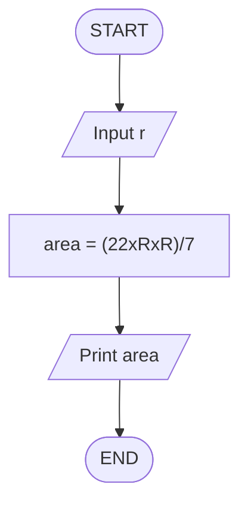
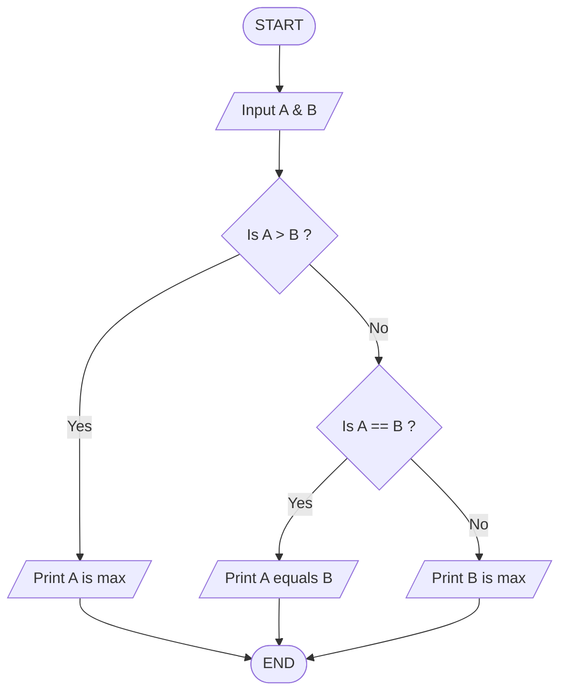
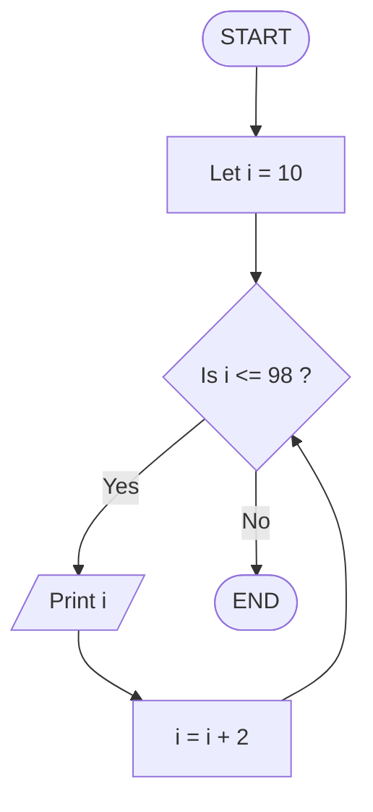
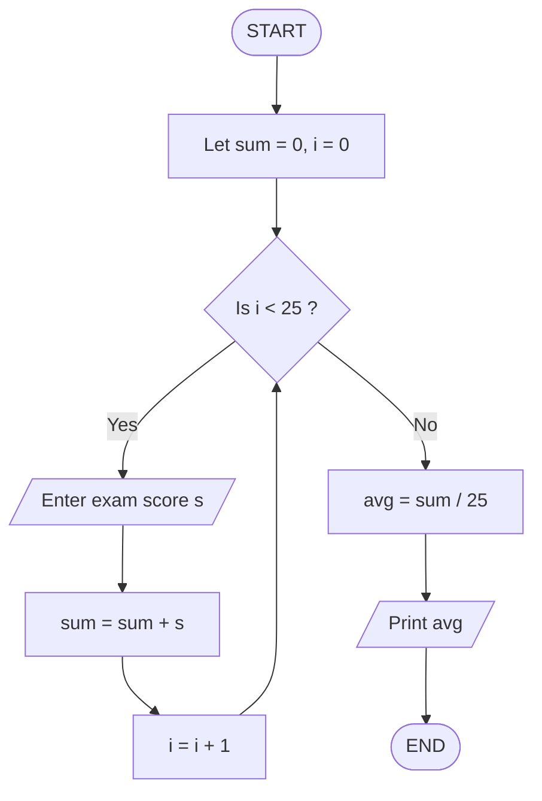

# Practice Questions of Flowcharts & Pseudocodes

## Questions :

1. [Calculate the area of a circle](#1-calculate-the-area-of-a-circle)
2. [Find the greatest from 2 numbers](#2-find-the-greatest-from-2-numbers)
3. [Print the Even numbers between 9 and 100](#3-print-the-even-numbers-between-9-and-100)
4. [Calculating the average from 25 exam scores](#4-calculating-the-average-from-25-exam-scores)

---

### 1. Calculate the area of a circle

- Input : radius R
- Output : area of circle

**Flowchart :**


**Pseudocode :**
```text
1. Start
2. Input R
3. area = (22xRxR)/7
4. Print area
5. End
```

---

### 2. Find the greatest from 2 numbers

- Input : Numbers A & B
- Output : Max of 2 numbers

**Flowchart :**


**Pseudocode :**
```text
1. Start
2. Input A & B
3. If A > B ? do
    3.1 Print A is max
4. else 
    4.1 If A == B ? do
        4.1.1 Print A equals B
    4.2 else Print B is max
5. End
```

---

### 3. Print the Even numbers between 9 and 100

- Input : nothing
- Output : Even numbers between 9 and 100

**Flowchart :**


**Pseudocode :**
```text 
1. Start
2. Let i = 10
3. While i <= 98 do
    3.1 Print i
    3.2 i = i + 2
4. End
```

---

### 4. Calculating the average from 25 exam scores

- Input : 25 exam scores
- Output : average of 25 exam scores

**Flowchart :**


**Pseudocode :**
```text 
1. Start
2. Let sum = 0, i = 0
3. While i < 25 do
    3.1 Enter exam score s 
    3.2 sum = sum + s
    3.3 i = i + 1
4. avg = sum / 25
5. Print avg
6. End
```

---