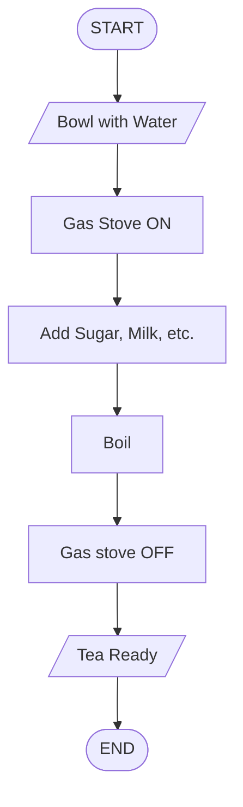
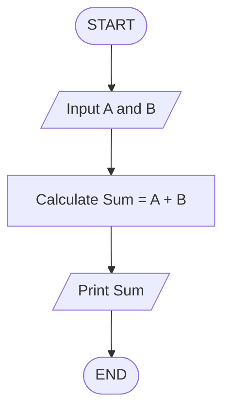
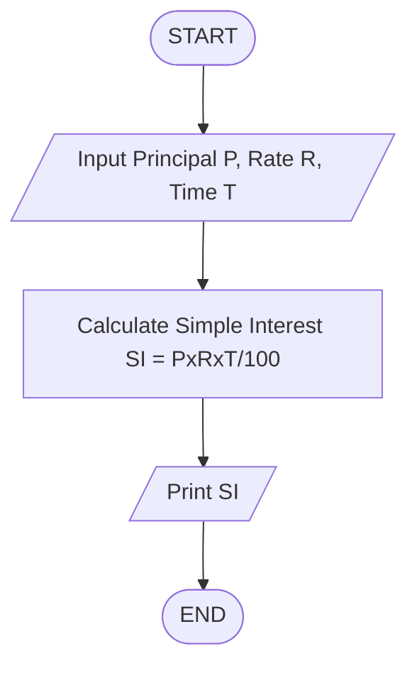
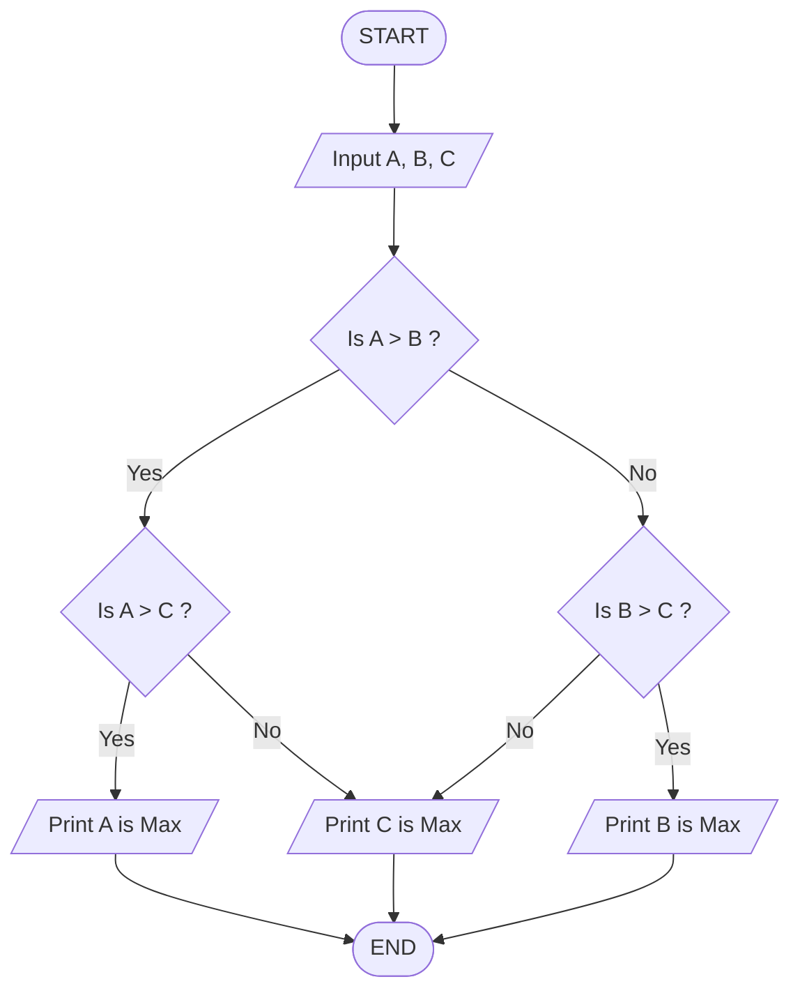
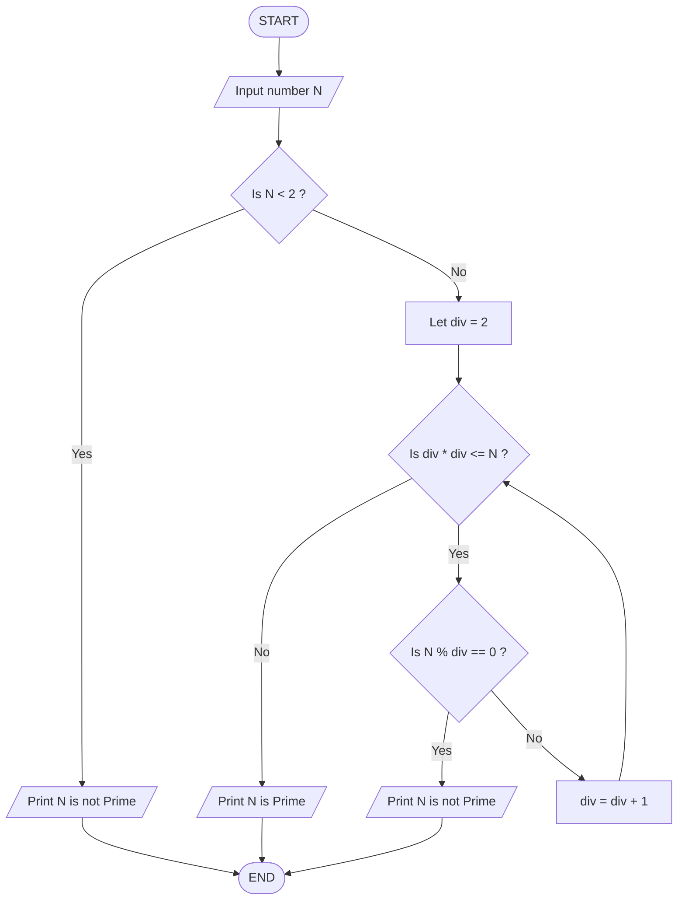
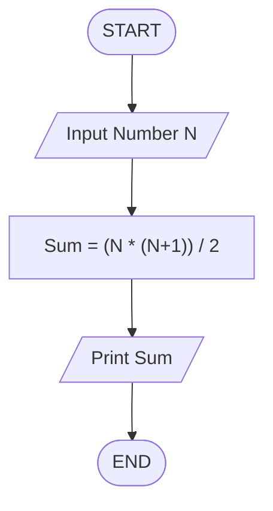
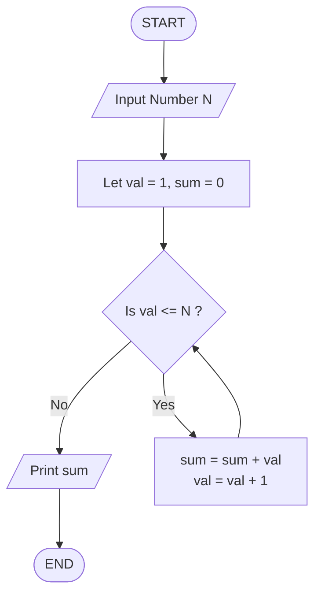

# Flowcharts & Pseudocodes

## Topics :

1. What are flowcharts ?
2. Flowchart Components
3. Sum of 2 Numbers
4. Calculate Simple Interest
5. Max of 3 Numbers
6. Find if a Number is Prime or not
7. Sum of first N Natural Numbers

---

### Flowcharts :

- Diagrams to represent solutions of problems
- Solution → Small Parts → Logically Arrange
- Eg. Problem : Make Tea  
Solution : 



---

### Components :

| Shape Name    | Flowchart Meaning     | Visual Symbol  |
| :------------ | :-------------------- | :-----------:  |
| Oval / Pill   | Start / End Points    | ⬭              |
| Parallelogram | Input / Output Data   | ▱              |
| Rectangle     | Process / Calculation | ▭              |
| Diamond       | Decision / Condition  | ◇              |
| Arrows        | Direction of Flow     | → / ↓          |

---

### Pseudocodes :

- Solutions written in English

---

**Logic for Solving any problem : Know the inputs & outputs**

---

### Examples :

**1. Sum of 2 Numbers :** 

- Inputs : A & B
- Output : Sum = A + B

**Flowchart :**


**Pseudocode :**
```text
1. Start
2. Input A & B
3. Calculate Sum = A + B
4. Print Sum 
5. End
```

---

**2. Calculate Simple Interest :**

- Inputs : Principal P, Rate R, Time T
- Output : Simple Interest (SI) = (PxRxT)/100



**Pseudocode :**
```text
1. Start
2. Input Principal P, Rate R, Time T
3. Calculate Simple Interest SI = (PxRxT)/100
4. Print SI
5. End
```

---

**3. Max of 3 Numbers :**

- Inputs : A, B, C
- Output : Max of 3 numbers

**Flowchart :**

 
**Pseudocode :**
```text
1. Start
2. Input A, B, C
3. Is A > B?  
    3.1 If A > C do  
        3.1.1 Print A is Max  
    3.2 Else  
        3.2.1 Print C is Max
4. Else  
    4.1 If B > C?  
        4.1.1 Print B is Max  
    4.2 Else  
        4.2.1 Print C is Max
5.  End
```

---

**4. Find if a number is Prime or not :**

- Input : Number N
- Output : Prime or Not Prime

**Prime : 2 Factors (1 & No. itself)**  
**Non-Prime : More than 2 factors**

Logic : For Non-Prime, divide N by 2 to (N-1), if N % 2 upto (N-1) equals 0 then N is not Prime ( % → Modulo → Gives Remainder )  
Eg. 6   
- 6 % 2 = 0
- 6 % 3 = 0
- 6 % 4 = 2
- 6 % 5 = 1  
6 is not Prime  

**Remember : This approach is simple and useful for small numbers but for big numbers, it can be further optimised. <br> Time Complexity : O(N)** 

**Optimised Version : Instead of using (div < N) condition which will check all the numbers from 2 to till (N-1), use (div * div <= N) which will check till the root of N. <br> Time Complexity : O($\sqrt{N}$)**

**Flowchart :**


**Pseudocode :**
```text
1. Start
2. Input number N
3. If N < 2  
    3.1 Print N is not Prime  
    3.2 End
4. Let div = 2
5. While (div * div <= N) do 
    5.1 If (N % div == 0)                             
        5.1.1 Print N is not Prime  
        5.1.2 End
    5.2 Else
        5.2.1 div = div + 1
6. Print N is Prime
7. End
---
NOTE : While loop - runs till the condition is true (Use when you don't know the number of iterations)
```

---

**5. Sum of first N Natural Numbers :**

- Input : Number N
- Output : Sum from 1 to N

**Solution 1 :**

**Flowchart :**


**Algorithm :**
```text 
1. Start
2. Input Number N
3. Calculate Sum = (N*(N+1))/2
4. Print Sum 
5. End
```

---

**Solution 2 :**

**Flowchart :**


**Pseudocode :**
```text
1. Start
2. Input Number N
3. let val = 1, sum = 0
4. While val <= N do 
    4.1 sum = sum + val
    4.2 val = val + 1
5. Print sum
6. End
```

---